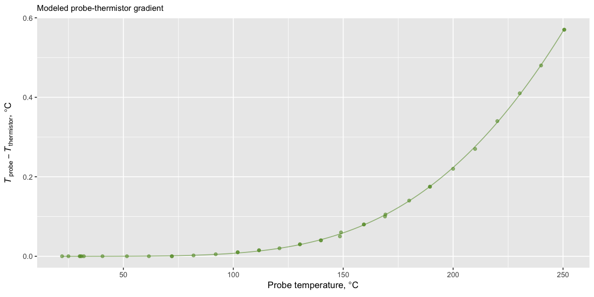
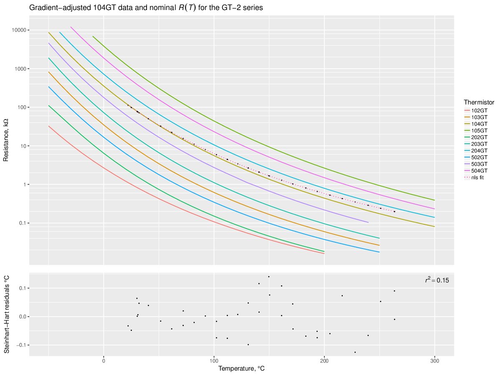

# GT-2 thermistor experiment

**How good is this thermistor?**

## Experiment 1

Thanks to [David Crocker](https://github.com/dc42) who has identified my thermistor from a vague description I gave him, now I know what it was supposed to be like. It is a 104GT glass thermistor by ATC Semitec. The codename obviously means *"an (approximately) 100k&Omega; Glass Thermistor"*. This is how we know:


```
Steinthart-Hart coefficients, 3-point estimation:  A = 0.0008149464, B = 0.0002077971, C = 0.0000000996
Steinthart-Hart coefficients, NLS fit to data:     A = 0.0008235063, B = 0.0002046960, C = 0.0000001247
```

The colored lines are [resistance-temeperature tables](https://github.com/selkovjr/gt-2-thermistor-experiment/blob/master/gt-2-glass-thermistors.tab) from [ATC Semitec's datasheet](http://www.atcsemitec.co.uk/gt-2-glass-thermistors.html); black dots are the measurements I took from the thermistor I received with the [BiQu Diamond Hotend](https://www.biqu.equipment/products/diamond-3d-printer-extruder-reprap-hotend-3d-v6-heatsink-3-in-1-out-multi-nozzle-extruder-prusa-i3-kit-for-1-75-0-4mm).

While the data points from the first experiment appear to straddle the nominal curve for 104GT pretty nicely, the Steinhart-Hart model residuals reveal at least one flaw in this experiment: oscilations and possibly drift in the thermostat.

To provide temperature signal to the thermostat while I measured the resistance of the proband thermistor, I used an auxiliary thermistor tucked under the insulation blanket on top of the nozzle, next to the heater cartridge. While this set-up helped reduce the lag between the two thermistors, it was also insecure and probably accounted for much of the observed drift. Also, I neglected to tune the thermostat and it oscillated more than it normally does, making it difficult to track the set value. The two thermistors are not entirely dissimilar, so I thought the thermostat would work well if I simply swapped the auxiliary one in without even calibrating it. It worked, but not too well.


## Experiment 2

In the following experiment, instead of taking many measurements around each temperature setting in the hope that they would average close to it, I waited until the thermostat settled before taking each measurment. Also, unlike the first time, I made efforts to calibrate the auxiliary thermistor (using the Beta model) and tuned the thermostat to it. This time, I placed the auxiliary thermistor inside a screw hole in the nozzle, so that it was completely embedded in the metal, but still close to the surface (I was unable to screw it in deeper).


This arrangement resulted in a greater lag between the heater and the auxiliary thermistor. Due to intense radiation from nozzle surface, it also allowed for a greater (although unknown in either experiment) thermal gradient between the heater and the auxiliary thermistor, resulting in severe over-regulation. The thermostat overshot its setpoints by more than 10&deg;C and required more than 10 minutes to settle. But on the upside, the oscillations were well-damped and the new location of the auxiliary thermistor was mechanically and thermally stable, making measurements easily reproducible to within instrument precision.

The resulting model residuals are rather more tame than in the first exepriment:


```
Steinthart-Hart coefficients, 3-point estimation:  A = 0.0008387813, B = 0.0001983343, C = 0.0000001545
Steinthart-Hart coefficients, NLS fit to data:     A = 0.0008401263, B = 0.0001971350, C = 0.0000001683
```

With oscillations and drift subdued, this experiment reveals what appears to be an irreducible non-linearity of model error, which can now be recognized in the residuals of the first experiment.

What is it? Does it mean that the Steinhart-Hart model is inadequate? Can this pattern of deviation be caused by gradient-induced bias between the thermistor and the reference thermocouple? Imperfect thermocouple calibration?

## A thought experiment

*No hardware was harmed in the making of this observation*

The squiggly Steinhart-Hart residuals seen in Experiment 2 demand explanation. Steinhart and Hart have good reputations and thermistors are not known for exceedingly complex behavior. My thermocouple instrument has been recently calibrated by a standards lab, and I used boiling water and an ice bath to check that it was still sane before I set out to do these experiments. That makes the thermal gradient between the thermocouple and the proband thermistor a prime suspect. How big a gradient is it and is it possible that the shape of the field surrounding the probe and the thermistor is responsible for the warped resuduals?

If this was a one-dimensional problem, the answer would be negative. Only a linear gradient can be a steady-state solution in an insulated rod. A quick search around the raw least-squares fit of the Steinhart-Hart model shows that no liear adjustment can achieve a better fit.

To find out what may be possible in two dimensions, I built this thermal model of the nozzle using [a version of Energy2D by AnaMarkH](https://github.com/AnaMarkH/energy2d):

[diamond-nozzle.e2d](diamond-nozzle.e2d)


> [The master build of Energy2D](http://energy.concord.org/energy2d/) did not work at this scale because of its grid size and resolution limitations. Also, AnaMarkH's version has an improved solver that eliminates a couple nasty artifacts. I did not have to build his version because the repo includes a pre-built jar; I just ran `java -jar energy2d/exe/energy2d.jar`.

This model is dodgy in too many ways to mention, yet it simulates the sort of gradient that could be responsible for the warp.

Varying model heater temperature to match measured temperatures at the probe produced the following dependence of thermistor-probe offset on probe temperature:



This model is likely wrong about the magnitude of the gradient and even its direction. But, by what seems like a stroke of luck, it still contains useful information. Negating the simulated offsets and scaling them 23x minimizes the Stheinhart-Hart resuduals, completely eliminating the squiggle (and thus confirming my suspicion about its origin):



```
Steinthart-Hart coefficients, 3-point estimation:  A = 0.0006719893, B = 0.0002241540, C = 0.0000000704
Steinthart-Hart coefficients, NLS fit to data:     A = 0.0006724225, B = 0.0002239644, C = 0.0000000723
```

Correcting probe temperatures using the raw results of gradient simulation or their best-fit exponential approximation minimizes Steinhart-Hart residuals even better (*r*<sup>2</sup> = 0.18 and 0.16, respectively). But, given the size of measurement error and the lack of physical sense in the perfect optimizer, it is more likely to result in destructive overfitting than in higher accuracy. The realistic adjustment is good enough.

*Le mieux est l'ennemi du bien.*
