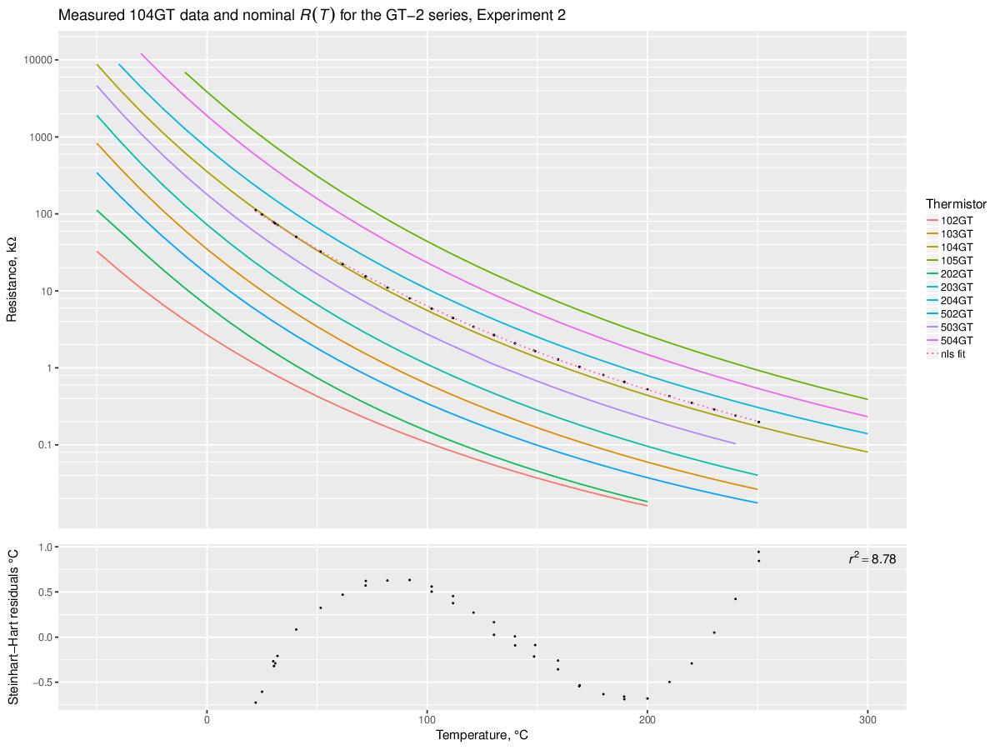

# GT-2 thermistor experiment

**How good is this thermistor?**

## Experiment 1

Thanks to [David Crocker](https://github.com/dc42) who has identified my thermistor from a vague description I gave him, now I know what it was supposed to be like. It is a 104GT glass thermistor by ATC Semitec. The codename obviously means *"an (approximately) 100k&Omega; Glass Thermistor"*. This is how we know:


```
Steinthart-Hart coefficients, 3-point estimation:  A = 0.0008149464, B = 0.0002077971, C = 0.0000000996
Steinthart-Hart coefficients, NLS fit to data:     A = 0.0008235063, B = 0.0002046960, C = 0.0000001247
```

The colored lines are [resistance-temeperature tables](https://github.com/selkovjr/gt-2-thermistor-experiment/blob/master/gt-2-glass-thermistors.tab) from [ATC Semitec's product leaflet](http://www.atcsemitec.co.uk/gt-2-glass-thermistors.html); black dots are the measurements I took from the thermistor I received with the [BiQu Diamond Hotend](https://www.biqu.equipment/products/diamond-3d-printer-extruder-reprap-hotend-3d-v6-heatsink-3-in-1-out-multi-nozzle-extruder-prusa-i3-kit-for-1-75-0-4mm) I bought on eBay.

While the data points from the first experiment appear to straddle the nominal curve for 104GT pretty nicely, the Steinhart-Hart model residuals reveal at least one flaw in this experiment: oscilations and possibly drift in thermostat. In this experiment, I used an auxiliary thermistor tucked under the insulation blanket on top of the nozzle, next to the heater cartridge, to provide temperature signal to the thermostat while I measured the resistance of the thermistor I was calibrating. While this placement helped reduce the lag between the two thermistors, it was also insecure and probably accounted for much of the observed drift. Also, I neglected to tune the thermostat and it oscillated more than it normally does, making it difficult to catch the set value. The two thermistors are not entirely dissimilar, so I thought the thermostat would work well if I simply swapped the auxiliary one in without even calibrating it. It worked, but not well enough.


## Experiment 2

In the following experiment, instead of taking many measurements around each temperature setting in the hope that they would average close to it, I waited until the thermostat settled before taking each measurment. Also, unlike first time, I made efforts to calibrate the auxiliary thermistor (using the Beta model) and tuned the thermostat to it. This time, I placed the auxiliary thermistor inside a screw hole in the nozzle, so that it was completely embedded in the metal, but still close to the surface (I was unable to screw it in deeper). This arrangement resulted in a greater lag between the heater and the auxiliary thermistor. Due to intense radiation from nozzle surface, it also allowed for a greater (although unknown in both cases) thermal gradient between the heater and the auxiliary thermistor. The obvious downside of that was that the thermostat overshot its setpoints by more than 10&deg;C and required more than 10 minutes to settle. On the upside, the oscillations were well-damped and the new location of the auxiliary thermostat was mechanically and thermally stable, maknig measurements reproducible within instrument precision.

The resulting model residuals are rather more tame than in the first exepriment:



```
Steinthart-Hart coefficients, 3-point estimation:  A = 0.0008387813, B = 0.0001983343, C = 0.0000001545
Steinthart-Hart coefficients, NLS fit to data:     A = 0.0008401263, B = 0.0001971350, C = 0.0000001683
```

With oscillations and drift subdued, this experiment reveals what appears to be an irreducible non-linearity of model error, which can now be recognized in the residuals of the first experiment.

What is it? Does it mean that the Steinhart-Hart model is inadequate? Can this pattern of deviation be caused by gradient-induced bias between the thermistor and the reference thermocouple? Imperfect thermocouple calibration?

I will attempt to answer these questions in subsequent experiments.
