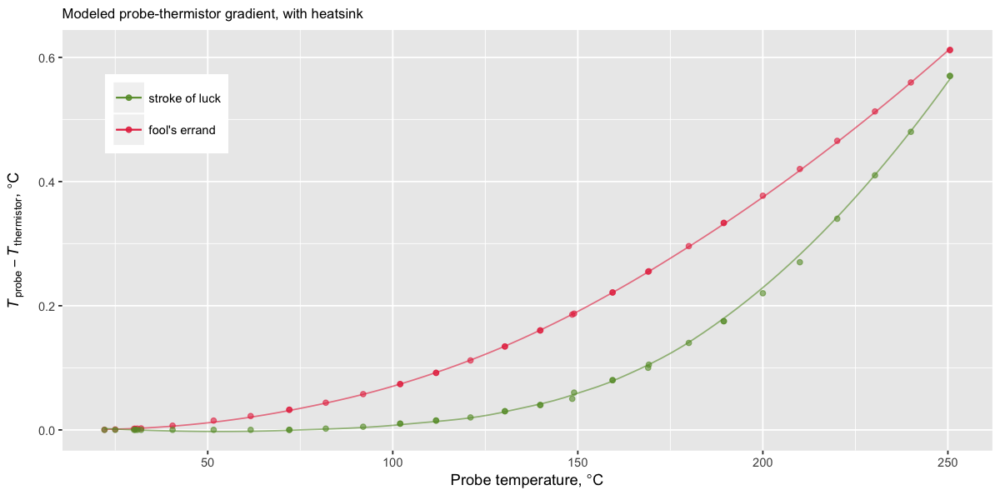
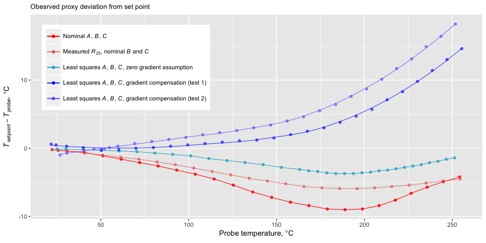

# GT-2 thermistor experiment

**How good is this thermistor?**

## Experiment 1

Thanks to [David Crocker](https://github.com/dc42) who has identified my thermistor from a vague description I gave him, now I know what it was supposed to be like. It is a 104GT glass thermistor by ATC Semitec. The codename obviously means *"an (approximately) 100k&Omega; Glass Thermistor"*. This is how we know:


```
Steinthart-Hart coefficients, 3-point estimation:  A = 0.0005949118, B = 0.0002426185, C = -0.0000000180
Steinthart-Hart coefficients, NLS fit to data:     A = 0.0008235064, B = 0.0002046959, C = 0.0000001247
```

The colored lines are [resistance-temeperature tables](https://github.com/selkovjr/gt-2-thermistor-experiment/blob/master/gt-2-glass-thermistors.tab) from [ATC Semitec's datasheet](http://www.atcsemitec.co.uk/gt-2-glass-thermistors.html); black dots are the measurements I took from the thermistor I received with the [BiQu Diamond Hotend](https://www.biqu.equipment/products/diamond-3d-printer-extruder-reprap-hotend-3d-v6-heatsink-3-in-1-out-multi-nozzle-extruder-prusa-i3-kit-for-1-75-0-4mm).

While the data points from the first experiment appear to straddle the nominal curve for 104GT pretty nicely, the Steinhart-Hart model residuals reveal at least one flaw in this experiment: oscilations and possibly drift in the thermostat.

To provide temperature signal to the thermostat while I measured the resistance of the proband thermistor, I used an auxiliary thermistor tucked under the insulation blanket on top of the nozzle, next to the heater cartridge. While this set-up helped reduce the lag between the two thermistors, it was also insecure and probably accounted for much of the observed drift. Also, I neglected to tune the thermostat and it oscillated more than it normally does, making it difficult to track the set value. The two thermistors are not entirely dissimilar, so I thought the thermostat would work well if I simply swapped the auxiliary one in without even calibrating it. It worked, but not too well.

> It did not work at all for the 3-point method, with the first and last temperature points picked, along with one in the middle. The C coefficient can't be negative because the inverse Steinhart-Hart equation depends on a square root of it. The 3-point results varied wildly in this experiment &mdash; from nonsensical to plausible, depending on the choice of points. Sergei Severin once advised his then-young student Schnoll, who lamented his inability to achieve convrgent measurements of reaction rates: "Take fewer measurements, and your life will be easier". The rest of this little report describes what happens when one doesn't heed the wisdom of the greats.

## Experiment 2

In the following experiment, instead of taking many measurements around each temperature setting in the hope that they would average close to it, I waited until the thermostat settled before taking each measurment. Also, unlike the first time, I made efforts to calibrate the auxiliary thermistor (using the Beta model) and tuned the thermostat to it. This time, I placed the auxiliary thermistor inside a screw hole in the nozzle, so that it was completely embedded in the metal, but still close to the surface (I was unable to screw it in deeper).


This arrangement resulted in a greater lag between the heater and the auxiliary thermistor. Due to intense radiation from nozzle surface, it also allowed for a greater (although unknown in either experiment) thermal gradient between the heater and the auxiliary thermistor, resulting in severe over-regulation. The thermostat overshot its setpoints by more than 10&deg;C and required more than 10 minutes to settle. But on the upside, the oscillations were well-damped and the new location of the auxiliary thermistor was mechanically and thermally stable, making measurements easily reproducible to within instrument precision.

The resulting model residuals are rather more tame than in the first exepriment:


```
Steinthart-Hart coefficients, 3-point estimation:  A = 0.0008336840, B = 0.0001991579, C = 0.0000001516
Steinthart-Hart coefficients, NLS fit to data:     A = 0.0008324170, B = 0.0001985115, C = 0.0000001625
```

With oscillations and drift subdued, this experiment reveals what appears to be an irreducible non-linearity of model error, which can now be recognized in the residuals of the first experiment.

What is it? Does it mean that the Steinhart-Hart model is inadequate? Can this pattern of deviation be caused by gradient-induced bias between the thermistor and the reference thermocouple? Imperfect thermocouple calibration?

## A thought experiment

*No hardware was harmed in the making of this observation*

The squiggly Steinhart-Hart residuals seen in Experiment 2 demand explanation. Steinhart and Hart have good reputations and thermistors are not known for exceedingly complex behavior. My thermocouple instrument has been recently calibrated by a standards lab, and I used boiling water and an ice bath to check that it was still sane before I set out to do these experiments. That makes the thermal gradient between the thermocouple and the proband thermistor a prime suspect. How big a gradient is it and is it possible that the shape of the field surrounding the probe and the thermistor is responsible for the warped resuduals?

To test that possibility, I built this thermal model of the nozzle using [a version of Energy2D by AnaMarkH](https://github.com/AnaMarkH/energy2d):

[diamond-nozzle.e2d](diamond-nozzle.e2d)


> [The master build of Energy2D](http://energy.concord.org/energy2d/) did not work at this scale because of its grid size and resolution limitations. Also, AnaMarkH's version has an improved solver that eliminates a couple nasty artifacts. I did not have to build his version because the repo includes a pre-built jar; I just ran `java -jar energy2d/exe/energy2d.jar`.

This model is dodgy in too many ways to mention, yet it appears to be capable of simulating some properties of the field that could be responsible for the warp. I have no idea what those properties are.

Varying the temperature of simulated heater to match the observations at the probe produced the following dependence of thermistor-probe offset on probe temperature:


This model is likely wrong about the magnitude of the field and even its shape, but somehow, transforming the data by adding a linear function of the simulated offsets (negating and scaling them *by a factor of 23*)  minimizes the Stheinhart-Hart resuduals, completely eliminating the squiggle:


```
Steinthart-Hart coefficients, 3-point estimation:  A = 0.0006492344, B = 0.0002279751, C = 0.0000000558
Steinthart-Hart coefficients, NLS fit to data:     A = 0.0006509953, B = 0.0002275946, C = 0.0000000577
```

That is a remarkably good fit, free of obvious artifacts. The thermal model must be right about something. The question is, will it be right every time, or was this a stroke of luck?


## Sanity check

In an attempt to make the model a little more realistic, I added a heatsink:

[diamond-nozzle+heatsink.e2d](diamond-nozzle.heatsink.e2d)


Intuitively, it seems to be a better model. The addition of the heatsink equalized the field and flipped the gradient between the thermistor and the probe. The spread between all sampling points is now 4&deg;C. In the previous model, it was 7&deg;C &mdash; uncomfortably large. Also, the difference between the thermistor and the tip of the nozzle (this project's deliverable) seems more reasonable.

Interestingly, while this model is a stronger hint at the possibility that the thermal design of the Diamond Hotend was guided by rational thought, it does nothing to improve the warped Steinhart-Hart residuals. The only sensible transformation that makes it a minimizer of residuals is multiplication by zero.



> The series labeled *fool's errand* (red) shows how the gradient in the heatsink model varies with probe temperature. It is flipped and scaled 15% for easier comparison with the previous model, *lucky strike* (green).

This observation begs the question of how many non-trivial model configurations are possible that both match the observed temperature dependence at the probe and properly minimize Steinhart-Hart residuals for the thermistor. Another question (and probably one that should have been answered first) is whether the minimization of residuals by a model-derived transformation of probe temperatures makes it a good proxy.

The only answer obtained so far is that the warping of Steinhart-Hart residuals as a result of calibration by proxy can possibly be caused by temperature gradient.

## Closed-loop testing

All observations seem to indicate that a substantial thermal resistance exists betwen the thermistor site and the more peripheral location of the thermocouple probe. Therefore, no calibration attempt involving superficial contact between the hotend and a probe, or even inserting the probe into existing holes, will ever work in a live printer set-up, which, by design, is subject to high temperature gradients (what with that fan kicking in at 45&deg;C and going full speed at 150&deg;C). The only situations that will allow accurate calibration are those that minimize the gradient &mdash; either by reducing the distance between the thermistor and the probe or by insulating the hotend. Neither approach is practical without dismantling the hotend. The best way to do it is to take the thermistor out to calibrate it in a bath thermostat. At the high end of the range, it may need to be a molten metal bath.

In this last experiment, letting the printer take control of the hotend temperature with the proband thermistor in the loop, I observed numeric differences between set-point temperatures and probe readings. The following graph shows these differences plotted for each conceivable set of Steinhart-Hart coeefficients.



### Nominal values

Setting thermostat parameters from ATC Semitec data sheet resulted in a limited but uncomfortably large deviation. Especially uncomfortable is its direction: it makes the termistor appear cooler than the probe. Still, in the absence of calibration data, it is not a terrible solution. With proper tune-up, it can result in a working thermostat. The downside of this approach is that it is impossible to tell how accurate it will be.

### Nominal values with measured room-temperature resistance

Measuring thermistor resistance at room temperature can be done fairly accurately. With ambient temperature at 21&deg;C, the gradient inside the hotend is negligible. Adjusting the Steinhart-Hart equation using the measured room-temperature resistance (98400&Ohm; in this case) resulted in somewhat better behavior. It is still wrong, but not as wrong as with all nominal values informing the thermostat.

Note that the measured resistance is within the factory tolerance of 3%.

### Zero gradient assumption

A na&iuml;ve approach to calibration would be to ignore thermal resistance between the thermistor and the probe. This may be a fair assumption in the case of a small heater block, such as the original RepRap block or pretty much every hotend seen on the market today. It is an even better assumption if the heater block is insulated. I noticed the current trend in 3D printer design is to insulate the hotends as much as possible; that should improve temmperature accuracy, possibly allowing for *in situ* calibration.

In the Diamond Hotend, the observed temperature dependence of probe deviation completely invalidates the assumption of zero gradient. It is, indeed, the least deviant of all models tested, but it is such by design. It achieves this result by bending the truth, both figuratively and literally. I find no comfort in a (relatively) small deviation knowing that it could only be achieved with a non-convex transformation of temperature-resistance dependence. It implies a non-convex (and negative) gradient &mdash; a certain impossibility.

Among all estimates of Steinhart-Hart coefficients, I like the one that minimizes model residuals in the most sensible way, without obvious second-order distortions.
